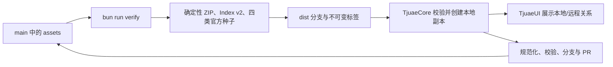

# TjuaeHub

TjuaeHub 是 Tjuae 的远程原子资产库，管理助手、引擎适配器、技能和 MCP 的审核、版本、
确定性构建与分发。TjuaeCore 维护用户自己的本地副本；两者通过稳定资产 ID、版本、提交
和摘要建立同步关系，不共享可变状态。

## 仓库结构

```text
assets/           审核通过并参与正式分发的原子资产包
submissions/      等待审核的候选原子资产包
schemas/          资产包、四类 Definition、索引与离线种子模式
policies/         官方来源、信任与撤销策略
kits/             本地浏览和验证工具
scripts/quality/  契约、品牌、安全与构建产物门禁
tests/            模式和构建行为测试
dist/             可由源码重新生成的索引、ZIP 和离线种子
```

## 数据流



Hub 的远程版本不会直接参与运行。TjuaeUI 的会话始终使用 Core 已安装并校验的本地资产；
市场更新必须由用户明确同步后才会改变本地副本。

## 原子资产包

- 包目录使用 `tjuaeasset-<name>`，清单固定为 `asset-package.json`。
- 每个包只包含一项 `assistant | engineAdapter | skill | mcp` 资产。
- Definition 入口分别固定为 `assistant.json`、`engine-adapter.json`、`SKILL.md`、`mcp.json`。
- 远程资产 ID 为 `<package>/<kind>/<localId>`；依赖只引用这种稳定 ID。
- 清单是纯声明数据，不支持贡献扩展、安装命令或生命周期钩子。
- `author` 和许可证保留真实来源；官方身份只由仓库策略与 provenance 产生。

引擎与 MCP 的配置字段必须显式声明运行时绑定。引擎和 stdio MCP 只绑定环境变量；
SSE/HTTP MCP 只绑定请求头。公开配置值和加密密钥都保存在 Core，并仅在会话启动时即时
注入；实际值、本机路径和实例 URL 不进入 Hub、索引或离线种子。

完整约束见 [模式说明](schemas/README.md)，官方迁移边界见
[官方资产迁移说明](docs/official-assets-migration.md)。

## 分发与离线种子

构建器输出：

- `dist/index.json`：唯一远程市场索引，符合 Index v2。
- `dist/tjuaeasset-*.zip`：逐包确定性归档。
- `dist/seed-manifest.json` 与内容寻址种子 ZIP：精确包含四类官方资产。

索引同时记录规范内容摘要和实际 ZIP 字节摘要。客户端先验证归档摘要，再解压、校验并
写入 Core 本地库。相同源码修订和 `SOURCE_DATE_EPOCH` 必须生成逐字节一致的产物。

## 本地开发

```bash
bun install --frozen-lockfile
just verify
```

## 许可证

本项目采用 Apache-2.0 许可证。必要的上游来源与历史版权归属见
[UPSTREAM.md](UPSTREAM.md)。
