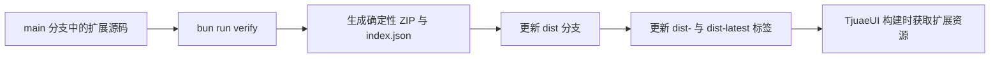

# TjuaeHub

TjuaeHub 是 TjuaeUI 的扩展清单、验证与分发仓库，用于管理智能体适配器、技能、
助手、MCP 服务器等扩展资源。

## 仓库结构

```text
extensions/       已启用并参与正式分发的扩展
pending/          等待验证和启用的候选扩展
schemas/          唯一受支持的扩展清单 JSON Schema
kits/             扩展开发与本地验证工具
scripts/quality/  品牌、清单和构建产物门禁
tests/            模式与构建行为测试
```

## 分发流程



推送到 `main` 后，GitHub Actions 会重新验证源码和产物，再发布 `dist` 分支、
不可变的 `dist-<commit>` 标签以及指向最新产物的 `dist-latest` 标签。生成的 ZIP
由源码内容哈希校验，不依赖本地时间戳。

## 扩展契约

- 清单文件名固定为 `tjuae-extension.json`。
- 扩展包名使用 `tjuaeext-` 前缀。
- 引擎要求只通过 `engine.tjuae` 声明。
- `contributes.*` 支持内联数据或安全的 `$file:relative.json` 引用。
- 不支持旧文件名、旧引擎键、旧包名前缀或旧环境变量别名。

完整约束见 [模式说明](schemas/README.md) 和
[`extension-manifest.v1.schema.json`](schemas/extension-manifest.v1.schema.json)。

## 本地开发

```bash
bun install --frozen-lockfile
just verify
```

`just verify` 会调用 `bun run verify`，依次执行格式检查、品牌扫描、14 份扩展
清单验证、TypeScript 类型检查、测试、扩展构建以及生成产物验证。提交前必须全部
通过；获得推送授权后使用 `just push`。

## 许可证

本项目采用 Apache-2.0 许可证。必要的上游来源与历史版权归属见
[UPSTREAM.md](UPSTREAM.md)。
