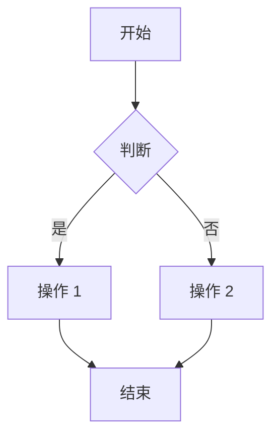
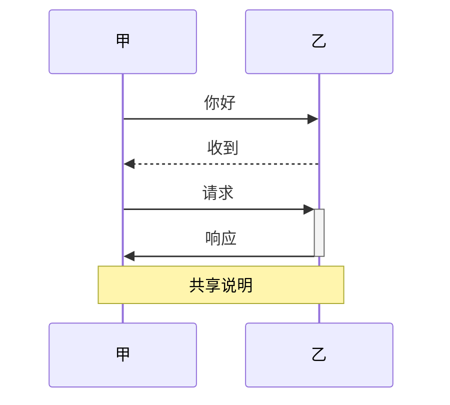
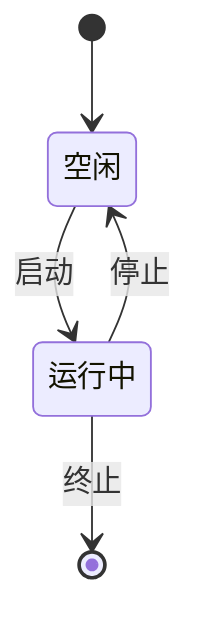
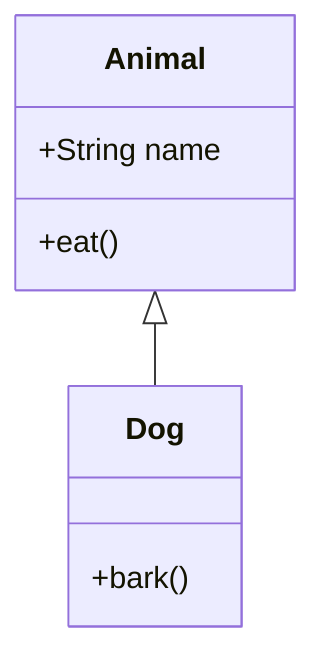
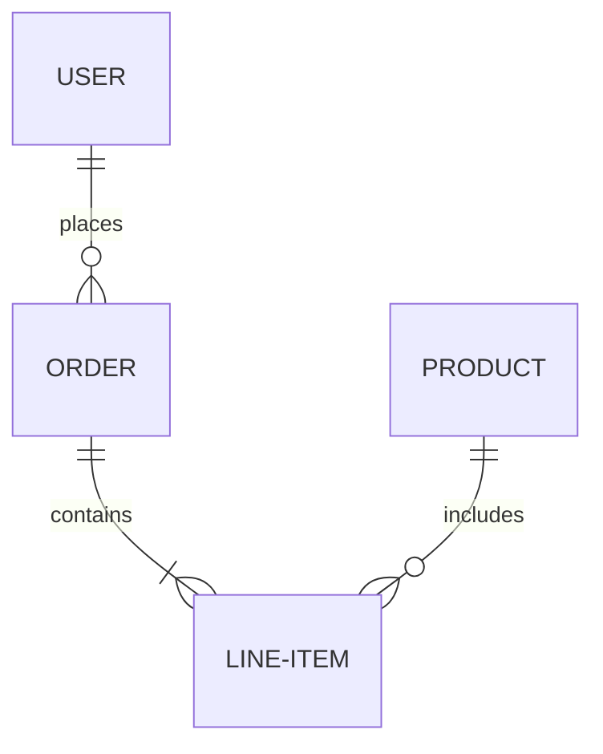

# Mermaid 语法速查

## 流程图

方向：`TD`（从上到下）、`LR`（从左到右）、`BT`、`RL`。

节点形状：

- `A[text]`：矩形；
- `A(text)`：圆角矩形；
- `A{text}`：菱形；
- `A([text])`：胶囊形；
- `A[[text]]`：子程序；
- `A[(text)]`：圆柱形；
- `A((text))`：圆形。

## 时序图

箭头：`->>` 为实线、`-->>` 为虚线、`-x` 为终止、`-)` 为开放箭头。

## 状态图

## 类图

关系：`<|--` 为继承、`*--` 为组合、`o--` 为聚合、`-->` 为关联。

## ER 图

基数：`||` 表示一个、`o|` 表示零个或一个、`}|` 表示一个或多个、`}o`
表示零个或多个。
